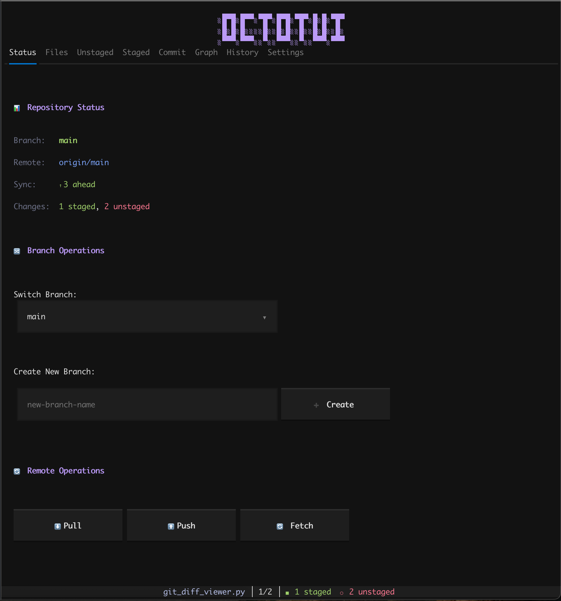
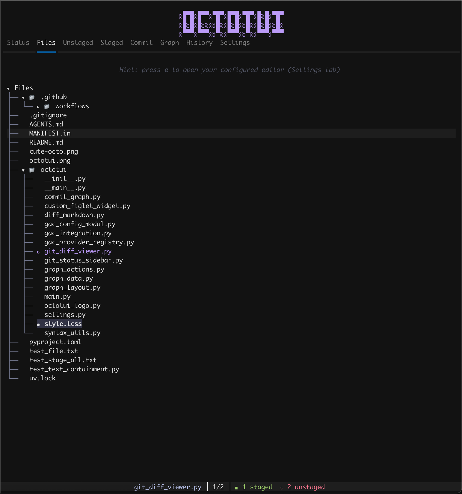
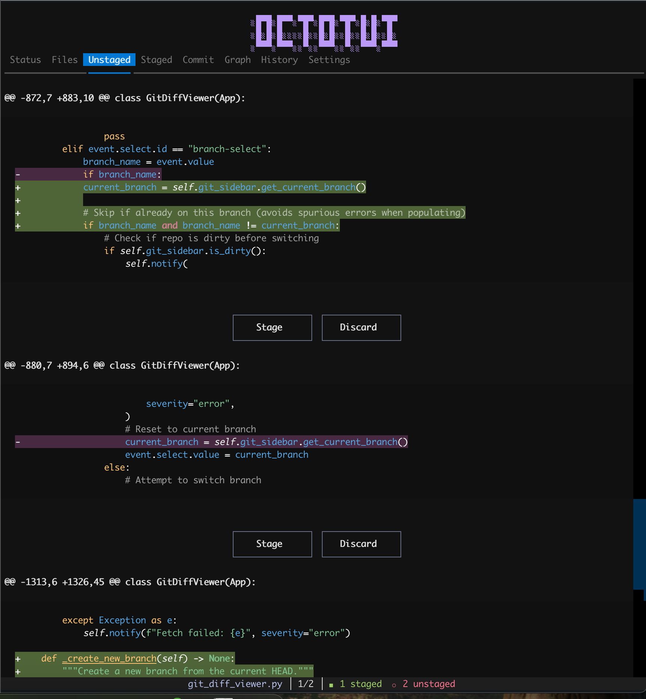
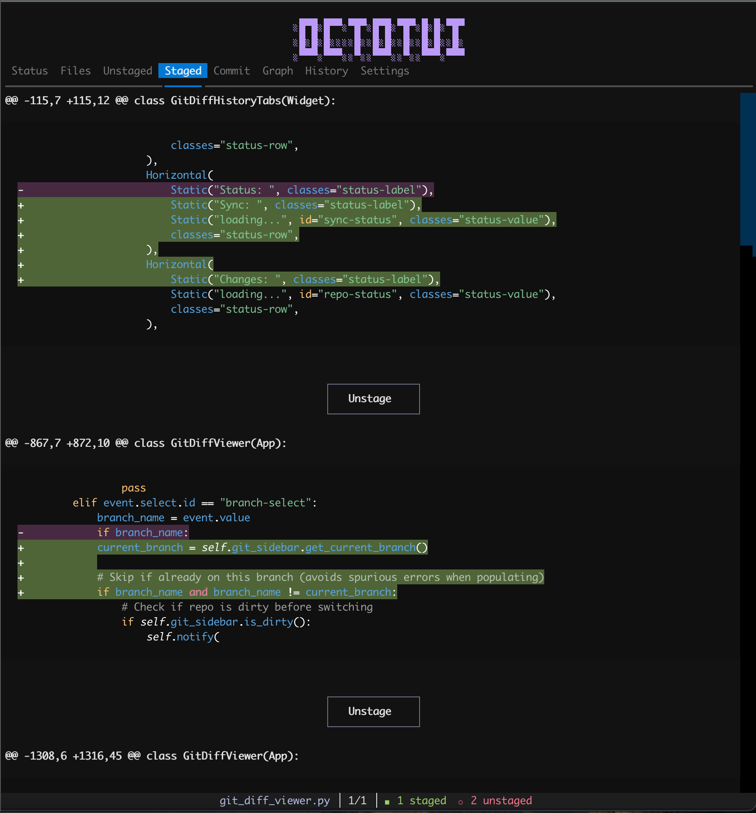
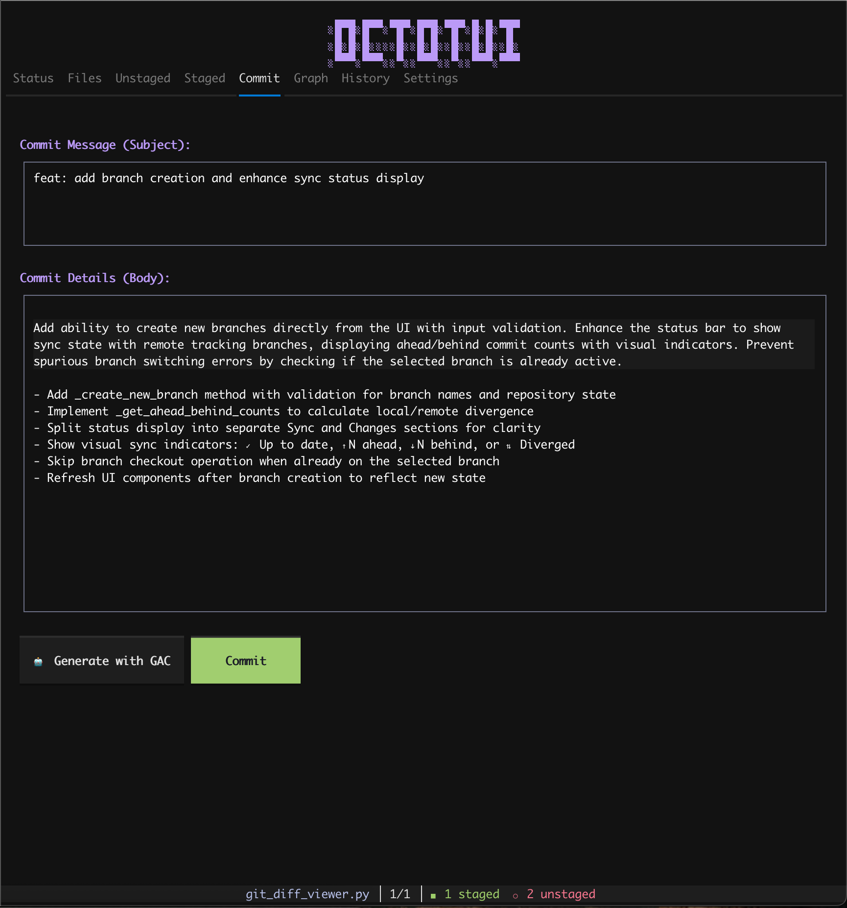
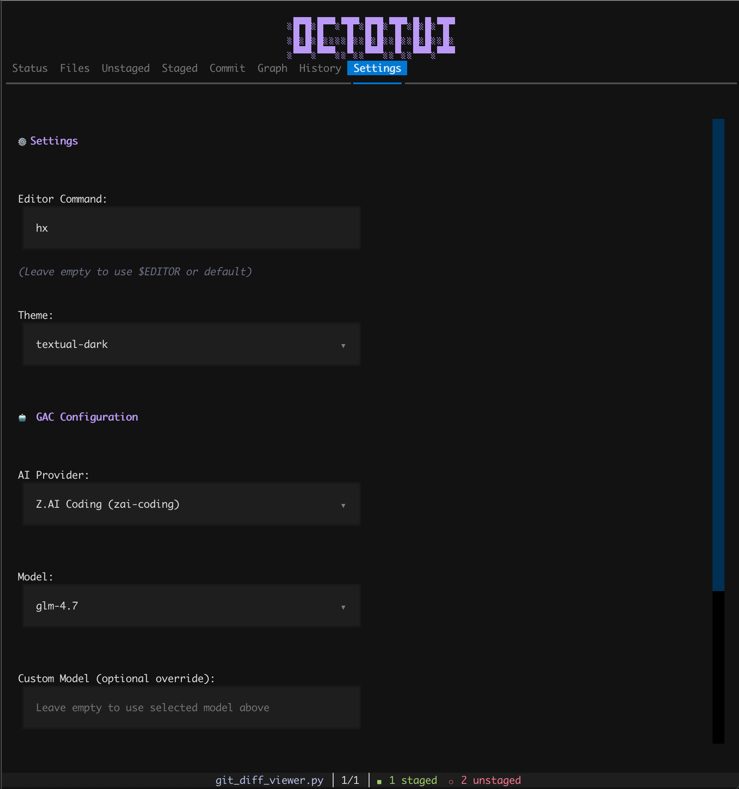
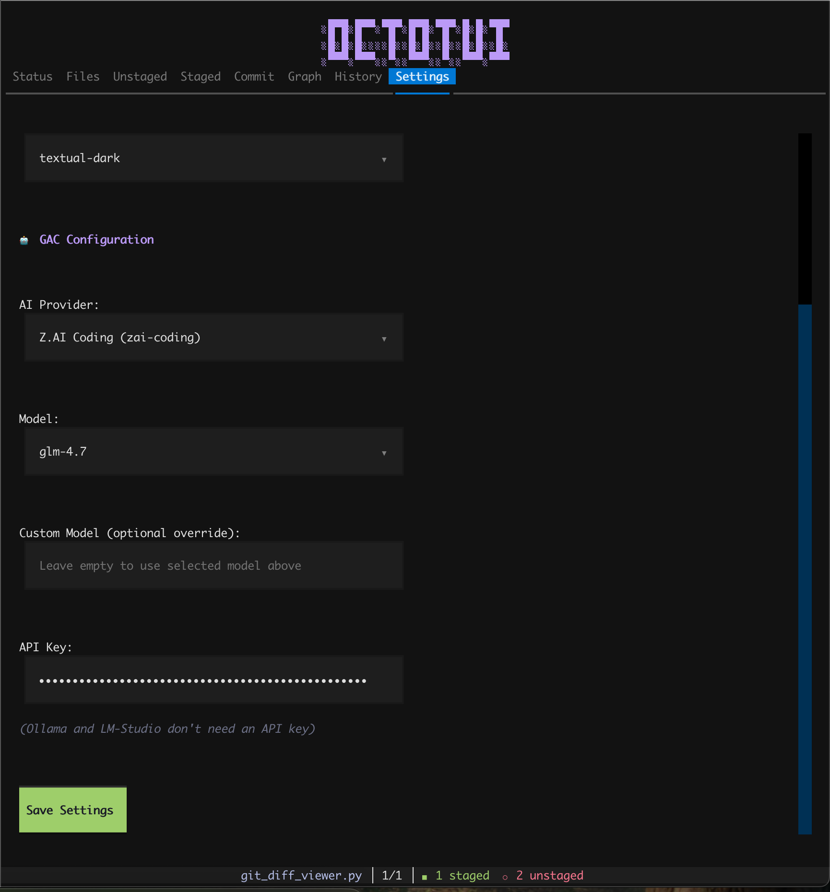

<div align="center">


# OctoTUI

[](https://pypi.org/project/octotui/)
[](https://pypi.org/project/octotui/)
[](https://opensource.org/licenses/MIT)
[](https://github.com/astral-sh/ruff)

**A terminal UI for Git, inspired by GitKraken**

[Installation](#installation) • [Screenshots](#screenshots) • [Keybindings](#keybindings)

</div>

---


OctoTUI brings a GitKraken-like experience to your terminal. Visual diffs, hunk-level staging, branch management, commit history—all without leaving the command line.

### Features

- Visual diffs with syntax highlighting
- Hunk-level staging/unstaging
- Branch visualization and management
- Commit history browsing
- AI-powered commit messages (via [GAC](https://github.com/cellwebb/gac))
- 100% free and open source

---

## Screenshots

### Status Tab
Repository status at a glance: branch, remote tracking, sync status (ahead/behind), working tree operations.



### Files Tab
Browse your repository with a tree view. Press `e` to open files in your editor.



### Unstaged Changes
Review unstaged changes with syntax-highlighted diffs. Stage or discard individual hunks.



### Staged Changes
See what's going into your next commit. Unstage hunks if needed.



### Commit Tab
Write commit messages with subject and body, or generate them with AI.



### Settings Tab
Configure your editor, theme, and AI provider. Supports 30+ providers including OpenAI, Anthropic, and Ollama.




---

## Installation

### Quick Start

```bash
uvx octotui
```

### From Source

```bash
git clone https://github.com/never-use-gui/octotui.git
cd octotui
uv run octotui
```

### Requirements

- Python 3.11+
- Git
- Terminal with 256+ colors

---

## AI Commit Messages (Optional)

```bash
uv pip install 'gac>=0.18.0'
```

Then press `Ctrl+G` in OctoTUI to configure your AI provider.

---

## Keybindings

### Navigation
| Key | Action |
|-----|--------|
| `↑/↓` | Navigate files/hunks |
| `←/→` | Navigate between files |
| `Enter` | Select file |
| `Tab` | Cycle through buttons |
| `e` | Edit file in external editor |

### View Switching
| Key | Tab |
|-----|-----|
| `1` | Status |
| `2` | Files |
| `3` | Unstaged |
| `4` | Staged |
| `5` | Commit |
| `6` | Graph |
| `7` | History |
| `8` | Settings |

### Git Operations
| Key | Action |
|-----|--------|
| `s` | Stage selected file |
| `u` | Unstage selected file |
| `a` | Stage all changes |
| `x` | Unstage all changes |
| `c` | Commit |
| `p` | Push |
| `o` | Pull |
| `r` | Refresh |
| `b` | Switch branch |

### AI & App
| Key | Action |
|-----|--------|
| `g` | Generate AI commit message |
| `Ctrl+G` | Configure GAC |
| `h` | Help |
| `q` | Quit |

---

## Git Status Colors

| Color | Meaning |
|-------|----------|
| Green | Staged |
| Yellow | Modified (unstaged) |
| Blue | Directory |
| Purple | Untracked |
| Red | Deleted |

---

## Tech Stack

- [Textual](https://textual.textualize.io/) - TUI framework
- [GitPython](https://gitpython.readthedocs.io/) - Git operations
- [GAC](https://github.com/cellwebb/gac) - AI commit generation

## License

MIT - see [LICENSE](LICENSE)
